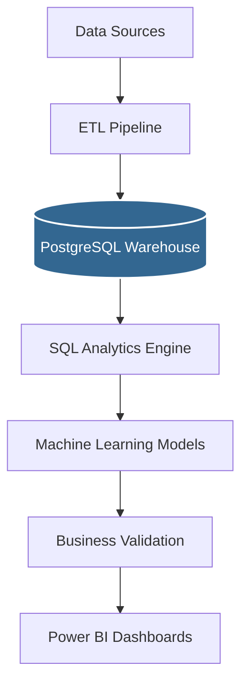

# Customer Finance 360° Intelligence Platform

> **An End-to-End Customer Analytics Platform for Retail Banking**

## Project Overview

The **Customer Finance 360° Intelligence Platform** is a production-grade analytics environment designed to solve critical retail banking challenges. It consolidates transactional, demographic, and behavioral data into an optimized Data Warehouse to provide a complete 360° view of the customer. By integrating SQL analytics with explainable Machine Learning (ML), this platform empowers banking executives to make data-driven decisions regarding customer retention, cross-selling, and risk management.

---

## Tech Stack

- **Languages:** Python (3.11), SQL
- **Data Warehouse:** PostgreSQL (15.0)
- **Data Processing:** Pandas, NumPy
- **Machine Learning:** Scikit-Learn, SHAP
- **Visualization:** Power BI
- **Version Control:** Git

---

## Architecture

The platform follows a modern ELT (Extract, Load, Transform) pattern with integrated Machine Learning.



---

## Folder Structure

```text
customer-finance-360/
│
├── data/                  # Local storage for raw/processed datasets (excluded from Git)
├── src/                   # Python source code for ETL and ML
├── src/sql/               # SQL Analytics Engine (DDL, Quality, KPIs)
├── models/                # Serialized model artifacts (excluded from Git)
├── dashboards/            # Power BI dashboard files and DAX measures
└── docs/                  # Architecture specs, validation reports, and defense guides
    ├── architecture/      # Detailed Mermaid architecture diagrams
    └── reports/           # Business insights, QA, and validation reports
```

---

## Features

- **Explainable Churn Prediction:** Tree-based ML modeling with SHAP values to identify churn drivers.
- **Customer Segmentation:** Unsupervised clustering categorizing customers into actionable cohorts.
- **Customer Lifetime Value (CLV):** Multi-variate mathematical engineering to project future revenue.
- **SQL Analytics Layer:** 100+ lines of modular SQL defining core banking KPIs.
- **Dual-Layer Validation:** Strict Technical Data Quality checks coupled with Business Realism Validation.
- **Executive BI Dashboards:** A meticulously designed Power BI presentation layer.

---

## Installation

```bash
# 1. Clone the repository
git clone https://github.com/yourusername/customer-finance-360.git
cd customer-finance-360

# 2. Install dependencies
pip install -r requirements.txt

# 3. Configure environment variables (Edit with your DB credentials)
cp .env.example .env

# 4. Initialize PostgreSQL Schema
psql -U postgres -d customer360 -f src/sql/00_create_schema.sql

# 5. Run the complete end-to-end pipeline
python -m src.etl.data_ingestion
python -m src.etl.warehouse_loader
python -m src.ml.churn_model
python -m src.ml.segmentation_model
python -m src.etl.data_quality
python -m src.etl.business_validation
```

---

## Results

By leveraging this platform, a retail bank can achieve the following outcomes:
- **Identify High-Risk Customers** up to 3 months before attrition using predictive ML.
- **Improve Campaign Targeting** by utilizing behavioral segments and SHAP drivers.
- **Analyze Revenue Drivers** through granular transaction decomposition and Star Schema SQL queries.
- **Optimize Customer Lifetime Value (CLV)** by proactively upselling high-affinity products.

---

## Links to Detailed Docs

For deep-dives into the architecture, business logic, and interview discussion points, explore the following documentation:

**Architecture Diagrams (`docs/architecture/`)**
- [Overall Solution Architecture](docs/architecture/solution_architecture.md)
- [ETL Pipeline](docs/architecture/etl_pipeline.md)
- [Star Schema](docs/architecture/star_schema.md)
- [Machine Learning Pipeline](docs/architecture/ml_pipeline.md)

**Business & Technical Reports (`docs/reports/`)**
- [Business Insights & Outcomes](docs/reports/business_insights.md)
- [Interview Defense Guide](docs/reports/interview_defense.md)
- [Data Quality Validation Report](docs/reports/data_quality_report.md)
- [Business Realism Validation Report](docs/reports/business_validation_report.md)
