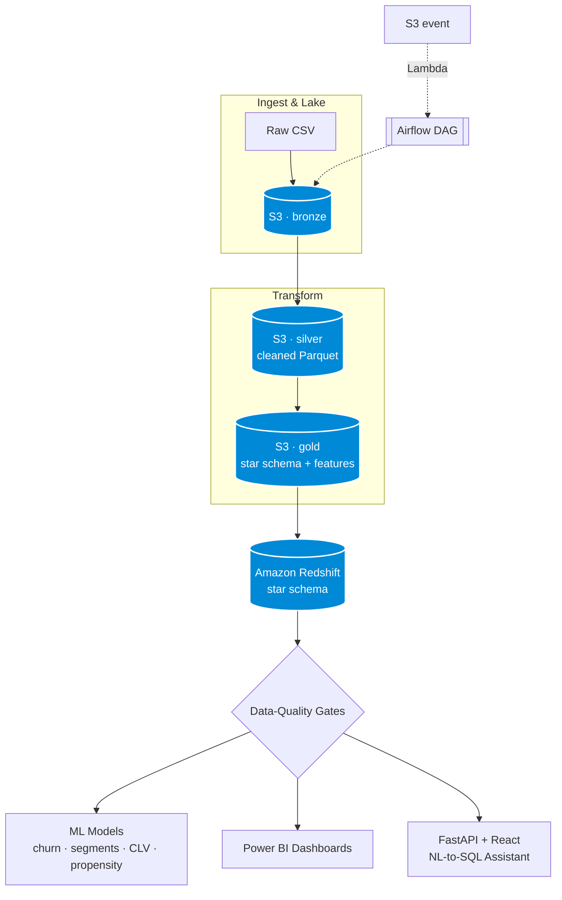
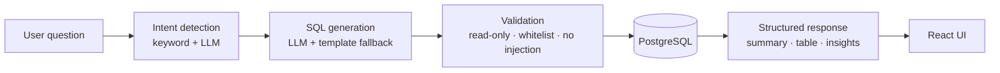

<div align="center">

# 💳 FinSight 360°

### Customer Finance Intelligence & AI-Powered Analytics Platform

*An end-to-end retail-banking platform: a cloud data-lake pipeline, explainable ML, and a natural-language analytics assistant — from raw data to executive decisions.*

<br/>


<br/>


</div>

---

## 📑 Table of Contents

- [✨ What is FinSight 360?](#-what-is-finsight-360)
- [📊 By the Numbers](#-by-the-numbers)
- [🏗️ Architecture](#️-architecture)
- [☁️ Cloud Data Pipeline (AWS)](#️-cloud-data-pipeline-aws)
- [🤖 Machine Learning](#-machine-learning)
- [💬 AI Natural-Language-to-SQL Assistant](#-ai-natural-language-to-sql-assistant)
- [🚀 Quickstart](#-quickstart)
- [🗂️ Project Structure](#️-project-structure)
- [✅ Testing & CI](#-testing--ci)
- [📚 Documentation](#-documentation)
- [🗺️ Roadmap](#️-roadmap)

---

## ✨ What is FinSight 360?

FinSight 360° turns raw retail-banking data into decisions. It combines three layers into one platform:

1. **A cloud data-lake pipeline** — raw data lands in S3, is transformed with PySpark/Glue, and loaded into a Redshift star-schema warehouse, orchestrated by Airflow and guarded by data-quality gates.
2. **Explainable machine learning** — churn, segmentation, lifetime value, and campaign propensity models, with SHAP explanations.
3. **A conversational analytics assistant** — ask questions in plain English and get validated SQL, data tables, and insights through a React + FastAPI app.

> **Runs at `$0` locally** (LocalStack + local Spark + local Postgres) and, unchanged, on real AWS.

---

## 📊 By the Numbers

| Metric | Value |
|---|---:|
| 👥 Customers | **10,127** |
| 💸 Transactions | **1.3M+** |
| 🗄️ Warehouse tables (star schema) | **20+** |
| 🤖 ML models | **4** (churn · segmentation · CLV · propensity) |
| 💬 Supported business intents (NL→SQL) | **14** |
| 🧪 Automated tests | **9** (AWS layer) **+** assistant test suite |

---

## 🏗️ Architecture


```mermaid
flowchart TD
    subgraph Ingest & Lake
        A[Raw CSV] --> B[(S3 · bronze)]
    end
    subgraph Transform
        B --> C[(S3 · silver<br/>cleaned Parquet)]
        C --> D[(S3 · gold<br/>star schema + features)]
    end
    D --> E[(Amazon Redshift<br/>star schema)]
    E --> Q{Data-Quality Gates}
    Q --> ML[ML Models<br/>churn · segments · CLV · propensity]
    Q --> BI[Power BI Dashboards]
    Q --> AI[FastAPI + React<br/>NL-to-SQL Assistant]
    EVT[S3 event] -.->|Lambda| ORCH[[Airflow DAG]] -.-> B

    classDef store fill:#0089D6,stroke:#fff,stroke-width:2px,color:#fff;
    class B,C,D,E store;
```

---

## ☁️ Cloud Data Pipeline (AWS)

<details>
<summary><b>Click to expand — medallion lake, Spark transforms, Redshift, orchestration</b></summary>

<br/>

The pipeline processes the same 10,127 customers and 1.3M+ transactions as the base ELT, **preserving every engineered feature** (no stochastic regeneration).

| Stage | Module | AWS service |
|-------|--------|-------------|
| Ingest → **bronze** | `src/aws/s3_ingest.py` | S3 |
| Transform (**silver → gold**) | `src/aws/spark_transform.py`, `glue_job.py` | Glue (Spark) |
| Warehouse load | `src/aws/redshift_ddl.sql`, `redshift_load.py` | Redshift |
| Orchestration | `dags/finsight_pipeline_dag.py` | Airflow |
| Event trigger | `lambda/s3_trigger_lambda.py` | Lambda |
| Quality gates + CI | `src/aws/data_quality.py`, `.github/workflows/ci.yml` | — |

**Highlights**
- **Medallion architecture** — immutable bronze, cleaned silver, curated gold (facts partitioned by year, stored as Parquet).
- **Window-function feature engineering** — RFM, lag, rolling averages, and tenure, computed in Spark with **explicit ordering** so results are deterministic and identical run-to-run.
- **Redshift modelling** — `DISTKEY(customer_id)` on facts for node-local joins, `SORTKEY(date_key)` for time-range pruning; small dims replicated with `DISTSTYLE ALL`.
- **Data-quality gates** — row counts, `NOT NULL` keys, primary-key uniqueness, value ranges, and referential integrity; a failure fails the pipeline before bad data reaches analytics.

📄 Full write-up: **[docs/aws_architecture.md](docs/aws_architecture.md)**

</details>

---

## 🤖 Machine Learning

<details>
<summary><b>Click to expand — 4 models feeding the warehouse</b></summary>

<br/>

| Model | Algorithm | Output |
|-------|-----------|--------|
| **Churn Prediction** | Random Forest + **SHAP** | Churn probability, risk tier, top-3 risk drivers |
| **Customer Segmentation** | K-Means | 4 behavioral segments |
| **Customer Lifetime Value** | Random Forest Regressor | Predicted 12-month CLV + tier |
| **Campaign Propensity** | Logistic Regression | Response propensity + target priority |

Predictions are written back to the warehouse as `ml_*` tables, so both the dashboards and the NL-SQL assistant can query them with standard SQL.

📄 Details: **[docs/architecture/ml_pipeline.md](docs/architecture/ml_pipeline.md)** · **[docs/clv_model_card.md](docs/clv_model_card.md)**

</details>

---

## 💬 AI Natural-Language-to-SQL Assistant

<details>
<summary><b>Click to expand — ask questions in plain English</b></summary>

<br/>

Ask *"Which customers are at high risk of churn?"* and get an executive summary, a data table, SHAP risk drivers, and recommended actions — plus the generated SQL for transparency.


```mermaid
flowchart LR
    U[User question] --> I[Intent detection<br/>keyword + LLM]
    I --> G[SQL generation<br/>LLM + template fallback]
    G --> V[Validation<br/>read-only · whitelist · no injection]
    V --> X[(PostgreSQL)]
    X --> R[Structured response<br/>summary · table · insights]
    R --> UI[React UI]
```

- **14 business intents** across churn, CLV, segments, revenue, campaigns, and more.
- **Defense-in-depth SQL validation** — SELECT/WITH only, blocked keywords, comment stripping, table whitelist, enforced `LIMIT`, read-only transactions.
- **Backend** `ai_assistant/` (FastAPI) · **Frontend** `frontend/` (React + Vite).

📄 Design: **[docs/architecture/ai_assistant_design.md](docs/architecture/ai_assistant_design.md)**

</details>

---

## 🚀 Quickstart

<details open>
<summary><b>Option A — Cloud data pipeline (local, $0)</b></summary>

<br/>

```bash
pip install -r requirements.txt -r requirements-aws.txt
cp .env.aws.example .env

make up          # LocalStack (S3/Lambda) + local Redshift (Postgres)
make bootstrap   # create the S3 lake bucket + bronze/silver/gold zones
make pipeline    # ingest → transform → load → validate
make test        # ruff + pytest
make down        # tear it all down
```

</details>

<details>
<summary><b>Option B — Analytics assistant (API + UI)</b></summary>

<br/>

```bash
# Backend (FastAPI)
pip install -r requirements.txt
cp .env.example .env                       # add DB + LLM keys
uvicorn ai_assistant.main:app --reload --port 8000

# Frontend (React + Vite)
cd frontend && npm install && npm run dev  # http://localhost:5173
```

</details>

---

## 🗂️ Project Structure

```text
finsight-360/
├── src/
│   ├── aws/              # ☁️ S3 ingest, PySpark/Glue transforms, Redshift load, DQ gates
│   ├── etl/              # Python ETL (ingestion, warehouse loader, validation)
│   ├── ml/               # ML models (churn, segmentation, ...)
│   └── sql/              # Star-schema DDL, KPIs, views
├── ai_assistant/         # 💬 FastAPI NL-to-SQL service (intent, generation, validation)
├── frontend/             # ⚛️ React + Vite analytics UI
├── dags/                 # 🌀 Airflow pipeline DAG
├── lambda/               # ⚡ S3-event trigger
├── infra/                # 🐳 docker-compose (LocalStack + Redshift) + bootstrap
├── tests/                # 🧪 pytest (AWS layer: transform + data quality)
├── powerbi/              # 📊 Power BI dashboards
├── docs/                 # 📚 architecture, model cards, reports
└── Makefile              # 🛠️ one-command pipeline helpers
```

---

## ✅ Testing & CI

- **`make test`** runs `ruff` lint + `pytest` (9 tests covering the Spark feature logic and data-quality rules, including a **determinism test** proving the pandas → Spark migration doesn't change any values).
- **GitHub Actions** (`.github/workflows/ci.yml`) runs lint + tests on every push and pull request.

---

## 📚 Documentation

| Topic | Link |
|-------|------|
| ☁️ AWS data-lake architecture | [docs/aws_architecture.md](docs/aws_architecture.md) |
| 🏛️ Solution architecture | [docs/architecture/solution_architecture.md](docs/architecture/solution_architecture.md) |
| 🔄 ETL pipeline | [docs/architecture/etl_pipeline.md](docs/architecture/etl_pipeline.md) |
| ⭐ Star schema | [docs/architecture/star_schema.md](docs/architecture/star_schema.md) |
| 🤖 ML pipeline | [docs/architecture/ml_pipeline.md](docs/architecture/ml_pipeline.md) |
| 💬 AI assistant design | [docs/architecture/ai_assistant_design.md](docs/architecture/ai_assistant_design.md) |
| 📈 Business insights | [docs/reports/business_insights.md](docs/reports/business_insights.md) |
| 🎯 Interview defense guide | [docs/reports/interview_defense.md](docs/reports/interview_defense.md) |

---

## 🗺️ Roadmap

- [x] AWS data-lake pipeline (S3 → PySpark/Glue → Redshift)
- [x] Airflow + Lambda orchestration
- [x] Data-quality gates + pytest + CI
- [ ] Data **freshness** checks (recency gates)
- [ ] NoSQL serving layer (DynamoDB) for low-latency lookups
- [ ] dbt models for the SQL transformation layer

---

<div align="center">

*Built for reliable, explainable, decision-ready banking analytics.*

</div>
