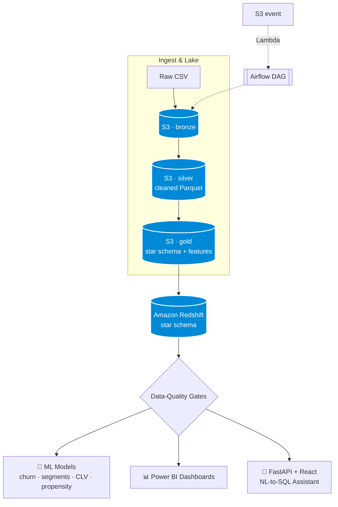
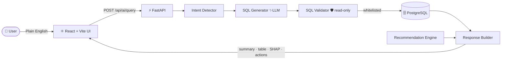

<div align="center">


### 🏦 Customer Finance 360° Intelligence Platform

*An end-to-end retail-banking platform: a cloud data-lake pipeline, explainable ML, and a natural-language analytics assistant — from raw data to executive decisions.*

<p>
  
  
  
  
</p>
<p>
  
  
  
  
  
</p>
<p>
  
  
  
  
</p>

[**🚀 Quick Start**](#-quick-start) &nbsp;•&nbsp; [**✨ Features**](#-features) &nbsp;•&nbsp; [**🏗 Architecture**](#-architecture) &nbsp;•&nbsp; [**☁️ AWS**](#️-cloud-data-pipeline-aws) &nbsp;•&nbsp; [**🔌 API**](#-api-reference) &nbsp;•&nbsp; [**🧠 ML**](#-machine-learning)

</div>

---

## 💡 What is FinSight 360?

> **The SQL barrier, removed.** Banking executives, marketing managers, and customer-success teams shouldn't need a data analyst to answer *"Which customers are at high risk of churn?"*

FinSight 360° turns raw retail-banking data into decisions. It combines three layers into one platform:

1. **☁️ Cloud data-lake pipeline** — raw data lands in S3, is transformed with PySpark/Glue, and loaded into a Redshift star-schema warehouse, orchestrated by Airflow and guarded by data-quality gates.
2. **🤖 Explainable machine learning** — churn, segmentation, lifetime value, and campaign-propensity models, with SHAP explanations.
3. **💬 Conversational analytics assistant** — ask in plain English and get validated SQL, data tables, and insights through a React + FastAPI app.

> 💵 **Runs at `$0` locally** (LocalStack + local Spark + local Postgres) and, unchanged, on real AWS.

```
"Which customers are most likely to leave next quarter?"
        │
        ▼
 🧠 Intent → 🛡 Safe SQL → 🗄 Warehouse → 📊 Answer + 💡 Recommendations
```

---

## 📊 By the Numbers

| Metric | Value |
|:--|--:|
| 👥 Customers | **10,127** |
| 💸 Transactions | **1.3M+** |
| 🗄️ Warehouse tables (star schema) | **20+** |
| 🤖 ML models | **4** (churn · segmentation · CLV · propensity) |
| 💬 Supported business intents (NL→SQL) | **14** |
| 🧪 Automated tests | **9** (AWS layer) **+** assistant test suite |

---

## ✨ Features

| | Capability | What it does |
|:--:|:--|:--|
| 🗣️ | **Natural-Language Querying** | Ask in English — no SQL required. Intent detection routes each question to the right analytics path. |
| 🛡️ | **Safe SQL Generation** | LLM-generated queries pass a validator enforcing **read-only, whitelisted** access before execution. |
| 📉 | **Explainable Churn Prediction** | Random-Forest model surfaces at-risk customers with **SHAP** driver visualizations. |
| 👥 | **Customer Segmentation** | Unsupervised K-Means clustering (+ PCA) groups customers into actionable cohorts. |
| 💰 | **Customer Lifetime Value** | Multi-variate CLV model projects future revenue per customer. |
| 🎯 | **Campaign Propensity** | Predicts which customers will respond to a campaign, with experiment tooling. |
| ☁️ | **Cloud Data Lake** | Medallion S3 lake → PySpark/Glue → Redshift, orchestrated with Airflow + Lambda. |
| 📊 | **Executive BI Dashboards** | Power BI presentation layer with curated DAX measures. |

---

## 🏗 Architecture


```mermaid
flowchart TD
    subgraph Lake[Ingest & Lake]
        A[Raw CSV] --> B[(S3 · bronze)]
        B --> C[(S3 · silver<br/>cleaned Parquet)]
        C --> D[(S3 · gold<br/>star schema + features)]
    end
    D --> E[(Amazon Redshift<br/>star schema)]
    E --> Q{Data-Quality Gates}
    Q --> ML[🤖 ML Models<br/>churn · segments · CLV · propensity]
    Q --> BI[📊 Power BI Dashboards]
    Q --> AI[💬 FastAPI + React<br/>NL-to-SQL Assistant]
    EVT[S3 event] -.->|Lambda| ORCH[[Airflow DAG]] -.-> B

    classDef store fill:#0089D6,stroke:#fff,stroke-width:2px,color:#fff;
    class B,C,D,E store;
```

<details>
<summary><b>💬 The AI assistant flow — click to expand</b></summary>

<br/>


```mermaid
flowchart LR
    U([👤 User]) -->|Plain English| FE[⚛️ React + Vite UI]
    FE -->|POST /api/ai/query| API[⚡ FastAPI]
    API --> ID[Intent Detector]
    ID --> SG[SQL Generator ✨LLM]
    SG --> SV[SQL Validator 🛡️ read-only]
    SV -->|whitelisted| DB[(🗄️ PostgreSQL)]
    DB --> RB[Response Builder]
    RE[Recommendation Engine] --> RB
    RB -->|summary · table · SHAP · actions| FE
```

**Dual-layer validation:** every run passes both a *technical data-quality* gate and a *business-realism* gate before results are trusted.

</details>

---

## ☁️ Cloud Data Pipeline (AWS)

<details>
<summary><b>Click to expand — medallion lake, Spark transforms, Redshift, orchestration</b></summary>

<br/>

The pipeline processes the same 10,127 customers and 1.3M+ transactions as the base ELT, **preserving every engineered feature** (no stochastic regeneration).

| Stage | Module | AWS service |
|:--|:--|:--|
| Ingest → **bronze** | `src/aws/s3_ingest.py` | S3 |
| Transform (**silver → gold**) | `src/aws/spark_transform.py`, `glue_job.py` | Glue (Spark) |
| Warehouse load | `src/aws/redshift_ddl.sql`, `redshift_load.py` | Redshift |
| Orchestration | `dags/finsight_pipeline_dag.py` | Airflow |
| Event trigger | `lambda/s3_trigger_lambda.py` | Lambda |
| Quality gates + CI | `src/aws/data_quality.py`, `.github/workflows/ci.yml` | — |

**Highlights**
- **Medallion architecture** — immutable bronze, cleaned silver, curated gold (facts partitioned by year, stored as Parquet).
- **Window-function feature engineering** — RFM, lag, rolling averages, and tenure, computed in Spark with **explicit ordering** so results are deterministic run-to-run.
- **Redshift modelling** — `DISTKEY(customer_id)` on facts for node-local joins, `SORTKEY(date_key)` for time-range pruning; small dims replicated with `DISTSTYLE ALL`.
- **Data-quality gates** — row counts, `NOT NULL` keys, primary-key uniqueness, value ranges, and referential integrity; a failure fails the pipeline before bad data reaches analytics.

📄 Full write-up: **[docs/aws_architecture.md](docs/aws_architecture.md)**

</details>

---

## 🧰 Tech Stack

<table>
<tr>
<td valign="top" width="33%">

**Frontend**
- React 19 + Vite 8
- JavaScript (ES6+ / JSX)
- Tailwind CSS
- Material Symbols · Geist · JetBrains Mono

</td>
<td valign="top" width="33%">

**Backend & AI**
- FastAPI + Uvicorn
- Google Gemini (`google-genai`)
- Pydantic
- Intent detection + SQL validation

</td>
<td valign="top" width="34%">

**Data / Cloud / ML**
- AWS S3 · Glue · Redshift · Lambda
- PySpark · Airflow · PostgreSQL 15
- Pandas · NumPy · SQLAlchemy
- scikit-learn · XGBoost · SHAP · Power BI

</td>
</tr>
</table>

---

## 🚀 Quick Start

<details open>
<summary><b>Option A — Cloud data pipeline (local, $0)</b></summary>

<br/>

```bash
git clone https://github.com/KAISTACK07/FinSight-360.git
cd FinSight-360

pip install -r requirements.txt -r requirements-aws.txt
cp .env.aws.example .env

make up          # LocalStack (S3/Lambda) + local Redshift (Postgres)
make bootstrap   # create the S3 lake bucket + bronze/silver/gold zones
make pipeline    # ingest → transform → load → validate
make test        # ruff + pytest
make down        # tear it all down
```

</details>

<details>
<summary><b>Option B — Analytics assistant (API + UI)</b></summary>

<br/>

```bash
# Backend (FastAPI)
pip install -r requirements.txt
cp .env.example .env                        # add DB + Gemini keys
psql -U postgres -d customer360 -f src/sql/00_create_schema.sql
uvicorn ai_assistant.main:app --reload --port 8000   # http://localhost:8000

# Frontend (React + Vite)
cd frontend && npm install && npm run dev   # http://localhost:5173
```

</details>

<details>
<summary><b>Option C — Classic Python ELT + ML</b></summary>

<br/>

```bash
python -m src.etl.data_ingestion
python -m src.etl.warehouse_loader
python -m src.ml.churn_model
python -m src.ml.segmentation_model
python -m src.ml.clv_model
python -m src.etl.data_quality
python -m src.etl.business_validation
```

> 💡 On Windows, `./run_pipeline.ps1` runs the full data pipeline for you.

</details>

---

## 🔌 API Reference

| Method | Endpoint | Description |
|:--|:--|:--|
| `POST` | `/api/ai/query` | Ask a natural-language question → structured answer (summary, table, SHAP, actions, SQL) |
| `GET` | `/api/ai/health` | Service + database health check |
| `GET` | `/api/ai/capabilities` | Supported intents and question types |

<details>
<summary><b>Example request & response</b></summary>

```bash
curl -X POST http://localhost:8000/api/ai/query \
  -H "Content-Type: application/json" \
  -d '{"question": "Which customers are at high risk of churn?"}'
```

```jsonc
{
  "summary": "142 customers show elevated churn risk this quarter...",
  "data": [ /* interactive table rows */ ],
  "risk_drivers": [ /* SHAP feature contributions */ ],
  "recommendations": [ "Prioritize retention outreach to top-decile risk..." ],
  "sql": "SELECT ... FROM fact_customer ... -- read-only"
}
```

**Defense-in-depth SQL validation:** `SELECT`/`WITH` only, blocked keywords, comment stripping, table whitelist, enforced `LIMIT`, read-only transactions.

</details>

---

## 🧠 Machine Learning

| Model | Algorithm | Artifact | Output |
|:--|:--|:--|:--|
| **Churn** | Random Forest + **SHAP** | `churn_rf_model.pkl` | Churn probability, risk tier, top-3 drivers |
| **Segmentation** | K-Means + PCA | `segmentation_kmeans_model.pkl` | 4 behavioral segments |
| **CLV** | RF Regressor | `clv_model.pkl` | Predicted 12-month CLV + tier |
| **Campaign Propensity** | Logistic Regression | *(trained on demand)* | Response propensity + target priority |

Predictions are written back to the warehouse as `ml_*` tables, so both the dashboards and the NL-SQL assistant can query them with standard SQL.

---

## 🗂️ Project Structure

```text
FinSight-360/
├── src/
│   ├── aws/              # ☁️ S3 ingest, PySpark/Glue transforms, Redshift load, DQ gates
│   ├── etl/              # Python ETL (ingestion, feature engineering, warehouse loader, validation)
│   ├── ml/               # 🤖 ML models (churn, segmentation, CLV, campaign)
│   └── sql/              # ⭐ Star-schema DDL, 14 KPI modules, views
├── ai_assistant/         # 💬 FastAPI NL-to-SQL service (intent, generation, validation, LLM)
├── frontend/             # ⚛️ React 19 + Vite analytics UI
├── dags/                 # 🌀 Airflow pipeline DAG
├── lambda/               # ⚡ S3-event trigger
├── infra/                # 🐳 docker-compose (LocalStack + Redshift) + bootstrap
├── tests/                # 🧪 pytest (AWS layer: transform + data quality)
├── models/               # 💾 serialized ML artifacts (.pkl)
├── powerbi/              # 📊 Power BI dashboards, DAX, Power Query (M)
├── docs/                 # 📚 architecture, model cards, reports
└── Makefile              # 🛠️ one-command pipeline helpers
```

---

## ✅ Testing & CI

- **`make test`** runs `ruff` lint + `pytest` — 9 tests covering the Spark feature logic and data-quality rules, including a **determinism test** proving the pandas → Spark migration doesn't change any values.
- **GitHub Actions** (`.github/workflows/ci.yml`) runs lint + tests on every push and pull request.

---

## 📚 Documentation

| Topic | Link |
|:--|:--|
| ☁️ AWS data-lake architecture | [docs/aws_architecture.md](docs/aws_architecture.md) |
| 🏛️ Solution architecture | [docs/architecture/solution_architecture.md](docs/architecture/solution_architecture.md) |
| 🔄 ETL pipeline | [docs/architecture/etl_pipeline.md](docs/architecture/etl_pipeline.md) |
| ⭐ Star schema | [docs/architecture/star_schema.md](docs/architecture/star_schema.md) |
| 🤖 ML pipeline | [docs/architecture/ml_pipeline.md](docs/architecture/ml_pipeline.md) |
| 💬 AI assistant design | [docs/architecture/ai_assistant_design.md](docs/architecture/ai_assistant_design.md) |
| 📈 Business insights | [docs/reports/business_insights.md](docs/reports/business_insights.md) |
| 🎯 Interview defense guide | [docs/reports/interview_defense.md](docs/reports/interview_defense.md) |

---

## 📈 Business Outcomes

- 🎯 **Identify high-risk customers** up to 3 months before attrition
- 📣 **Sharpen campaign targeting** using behavioral segments + SHAP drivers
- 💵 **Decompose revenue** through granular Star-Schema SQL
- 📊 **Grow CLV** by proactively upselling high-affinity products

---

## 🗺️ Roadmap

- [x] AWS data-lake pipeline (S3 → PySpark/Glue → Redshift)
- [x] Airflow + Lambda orchestration
- [x] Data-quality gates + pytest + CI
- [ ] Data **freshness** checks (recency gates)
- [ ] NoSQL serving layer (DynamoDB) for low-latency lookups
- [ ] dbt models for the SQL transformation layer

---

<div align="center">

### 👨‍💻 Author

**Lakshay Saini**

*If this project helped you, consider giving it a ⭐*

<sub>Built for reliable, explainable, decision-ready banking analytics.</sub>

</div>
