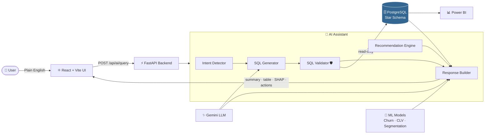
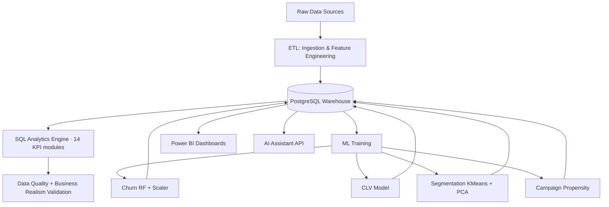

<div align="center">


### 🏦 Customer Finance 360° Intelligence Platform

**Ask your data anything — in plain English — and get executive-ready answers, powered by AI + ML.**

<p>
  
  
  
  
  
  
</p>

<p>
  
  
  
  
</p>

[**🚀 Quick Start**](#-quick-start) &nbsp;•&nbsp; [**✨ Features**](#-features) &nbsp;•&nbsp; [**🏗 Architecture**](#-architecture) &nbsp;•&nbsp; [**🔌 API**](#-api-reference) &nbsp;•&nbsp; [**🧠 ML Models**](#-machine-learning)

</div>

---

## 💡 What is FinSight 360?

> **The SQL barrier, removed.** Banking executives, marketing managers, and customer-success teams shouldn't need a data analyst to answer *"Which customers are at high risk of churn?"*

FinSight 360 is a **natural-language analytics interface** for retail banking. A user types a plain-English question; the platform detects intent, generates a **safe, read-only SQL query**, runs it against a PostgreSQL warehouse, and returns a structured answer — executive summary, interactive data table, SHAP-explained risk drivers, and recommended actions.

```
"Which customers are most likely to leave next quarter?"
        │
        ▼
 🧠 Intent → 🛡 Safe SQL → 🗄 Warehouse → 📊 Answer + 💡 Recommendations
```

---

## ✨ Features

| | Capability | What it does |
|:--:|:--|:--|
| 🗣️ | **Natural-Language Querying** | Ask in English — no SQL required. Intent detection routes each question to the right analytics path. |
| 🛡️ | **Safe SQL Generation** | LLM-generated queries pass a validator that enforces **read-only** access before execution. |
| 📉 | **Explainable Churn Prediction** | Random-Forest model surfaces at-risk customers with **SHAP** driver visualizations. |
| 👥 | **Customer Segmentation** | Unsupervised K-Means clustering (+ PCA) groups customers into actionable cohorts. |
| 💰 | **Customer Lifetime Value** | Multi-variate CLV model projects future revenue per customer. |
| 🎯 | **Campaign Propensity** | Predicts which customers will respond to a campaign, with experiment tooling. |
| 🧱 | **SQL Analytics Layer** | 14 modular SQL files defining core banking KPIs on a Star Schema warehouse. |
| 📊 | **Executive BI Dashboards** | Power BI presentation layer with curated DAX measures. |

---

## 🏗 Architecture


```mermaid
flowchart LR
    U([👤 User]) -->|Plain English| FE[⚛️ React + Vite UI]
    FE -->|POST /api/ai/query| API[⚡ FastAPI Backend]

    subgraph AI[🧠 AI Assistant]
        direction TB
        ID[Intent Detector] --> SG[SQL Generator]
        SG --> SV[SQL Validator 🛡️]
        SV --> RB[Response Builder]
        RE[Recommendation Engine] --> RB
    end

    API --> AI
    SV -->|read-only| DB[(🗄️ PostgreSQL<br/>Star Schema)]
    DB --> RB
    ML[🤖 ML Models<br/>Churn · CLV · Segmentation] --> RB
    LLM[✨ Gemini LLM] --> SG
    LLM --> RB
    RB -->|summary · table · SHAP · actions| FE
    DB --> BI[📊 Power BI]

    classDef db fill:#336791,stroke:#fff,color:#fff;
    class DB db;
```

<details>
<summary><b>📐 The data pipeline (ELT + ML) — click to expand</b></summary>

<br/>


```mermaid
flowchart TD
    A[Raw Data Sources] --> B[ETL: Ingestion & Feature Engineering]
    B --> C[(PostgreSQL Warehouse)]
    C --> D[SQL Analytics Engine · 14 KPI modules]
    C --> E[ML Training]
    E --> E1[Churn RF + Scaler]
    E --> E2[CLV Model]
    E --> E3[Segmentation KMeans + PCA]
    E --> E4[Campaign Propensity]
    D --> F[Data Quality + Business Realism Validation]
    E1 & E2 & E3 & E4 --> C
    C --> G[Power BI Dashboards]
    C --> H[AI Assistant API]
```

**Dual-layer validation:** every run passes both a *technical data-quality* gate and a *business-realism* gate before results are trusted.

</details>

---

## 🧰 Tech Stack

<table>
<tr>
<td valign="top" width="33%">

**Frontend**
- React 19 + Vite 8
- JavaScript (ES6+ / JSX)
- Tailwind CSS
- Material Symbols · Geist · JetBrains Mono

</td>
<td valign="top" width="33%">

**Backend & AI**
- FastAPI + Uvicorn
- Google Gemini (`google-genai`)
- Pydantic
- Intent detection + SQL validation

</td>
<td valign="top" width="34%">

**Data & ML**
- PostgreSQL 15 (Star Schema)
- Pandas · NumPy · SQLAlchemy
- scikit-learn · XGBoost · SHAP
- Power BI (DAX + Power Query)

</td>
</tr>
</table>

---

## 🚀 Quick Start

<details open>
<summary><b>1️⃣ Backend & Data Pipeline (Python)</b></summary>

```bash
# Clone
git clone https://github.com/KAISTACK07/FinSight-360.git
cd FinSight-360

# Install dependencies
pip install -r requirements.txt

# Configure environment (add DB credentials + Gemini API key)
cp .env.example .env

# Initialize the warehouse schema
psql -U postgres -d customer360 -f src/sql/00_create_schema.sql

# Run the end-to-end pipeline
python -m src.etl.data_ingestion
python -m src.etl.warehouse_loader
python -m src.ml.churn_model
python -m src.ml.segmentation_model
python -m src.ml.clv_model
python -m src.etl.data_quality
python -m src.etl.business_validation
```

</details>

<details>
<summary><b>2️⃣ AI Assistant API (FastAPI)</b></summary>

```bash
uvicorn ai_assistant.main:app --reload --port 8000
# → API live at http://localhost:8000  ·  docs at /docs
```

</details>

<details>
<summary><b>3️⃣ Frontend (React + Vite)</b></summary>

```bash
cd frontend
npm install
npm run dev
# → UI live at http://localhost:5173
```

</details>

> 💡 **One-shot:** on Windows, `./run_pipeline.ps1` runs the full data pipeline for you.

---

## 🔌 API Reference

| Method | Endpoint | Description |
|:--|:--|:--|
| `POST` | `/api/ai/query` | Ask a natural-language question → structured answer (summary, table, SHAP, actions, SQL) |
| `GET` | `/api/ai/health` | Service + database health check |
| `GET` | `/api/ai/capabilities` | Supported intents and question types |

<details>
<summary><b>Example request & response</b></summary>

```bash
curl -X POST http://localhost:8000/api/ai/query \
  -H "Content-Type: application/json" \
  -d '{"question": "Which customers are at high risk of churn?"}'
```

```jsonc
{
  "summary": "142 customers show elevated churn risk this quarter...",
  "data": [ /* interactive table rows */ ],
  "risk_drivers": [ /* SHAP feature contributions */ ],
  "recommendations": [ "Prioritize retention outreach to top-decile risk..." ],
  "sql": "SELECT ... FROM fact_customer ... -- read-only"
}
```

</details>

---

## 🧠 Machine Learning

| Model | Algorithm | Artifact | Purpose |
|:--|:--|:--|:--|
| **Churn** | Random Forest (+ scaler) | `churn_rf_model.pkl` | Flag at-risk customers, explained with SHAP |
| **CLV** | Regression | `clv_model.pkl` | Project customer lifetime value |
| **Segmentation** | K-Means + PCA | `segmentation_kmeans_model.pkl` | Group customers into cohorts |
| **Campaign Propensity** | Classifier | *(trained on demand)* | Predict campaign response likelihood |

---

## 📁 Project Structure

```text
FinSight-360/
├── ai_assistant/        # FastAPI backend — intent, SQL gen/validation, LLM, recommendations
│   ├── main.py          # API entrypoint (/api/ai/*)
│   ├── intent_detector.py
│   ├── sql_generator.py · sql_validator.py
│   └── llm_service.py · recommendation_engine.py · response_builder.py
├── frontend/            # React 19 + Vite UI
├── src/
│   ├── etl/             # Ingestion, feature engineering, warehouse load, validation
│   ├── ml/              # Churn · CLV · Segmentation · Campaign models
│   └── sql/             # 14 modular KPI / schema / view definitions
├── models/              # Serialized ML artifacts (.pkl)
├── powerbi/             # Dashboard JSON, DAX measures, Power Query (M)
├── docs/                # Architecture diagrams & business/technical reports
└── requirements.txt
```

---

## 📚 Deep-Dive Docs

<details>
<summary><b>Architecture & business reports</b></summary>

<br/>

**Architecture (`docs/architecture/`)**
- [Solution Architecture](docs/architecture/solution_architecture.md) · [ETL Pipeline](docs/architecture/etl_pipeline.md) · [Star Schema](docs/architecture/star_schema.md) · [ML Pipeline](docs/architecture/ml_pipeline.md)

**Reports (`docs/reports/`)**
- [Business Insights](docs/reports/business_insights.md) · [Data Quality](docs/reports/data_quality_report.md) · [Business Validation](docs/reports/business_validation_report.md) · [Interview Defense](docs/reports/interview_defense.md)

</details>

---

## 📈 Business Outcomes

- 🎯 **Identify high-risk customers** up to 3 months before attrition
- 📣 **Sharpen campaign targeting** using behavioral segments + SHAP drivers
- 💵 **Decompose revenue** through granular Star-Schema SQL
- 📊 **Grow CLV** by proactively upselling high-affinity products

---

<div align="center">

### 👨‍💻 Author

**Lakshay Saini**

*If this project helped you, consider giving it a ⭐*

<sub>Built with Python, React, FastAPI & a lot of SQL.</sub>

</div>
