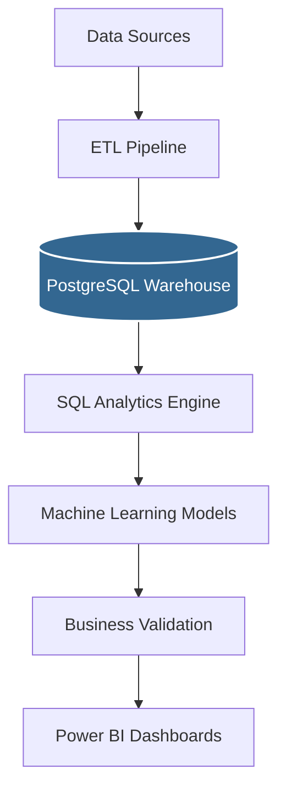
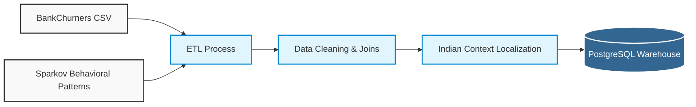
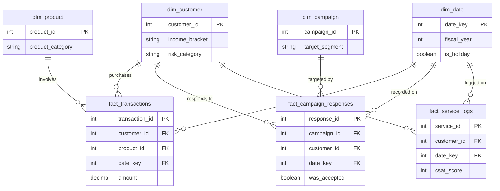
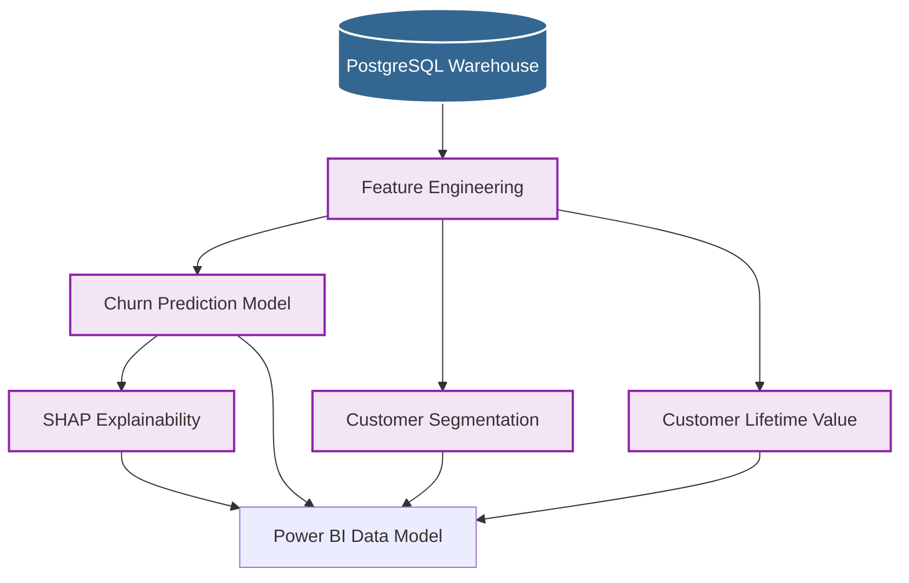

# Customer Finance 360° — Architecture Diagrams

This document contains the core architectural diagrams for the Customer Finance 360° Intelligence Platform. These diagrams illustrate the flow of data, the structure of the warehouse, and the integration of machine learning.

*All diagrams are generated using Mermaid.js and will render natively on GitHub.*

---

## 1. Overall Solution Architecture

This diagram illustrates the end-to-end data flow from raw sources to executive dashboards.

---

## 2. ETL Pipeline & Localization

This diagram shows how raw external datasets are combined, cleaned, and heavily localized to fit the context of an Indian retail bank before being loaded into the warehouse.

---

## 3. Star Schema Data Warehouse

The PostgreSQL database is organized into a highly optimized Star Schema, consisting of dimension tables (business entities) and fact tables (business events).

---

## 4. Machine Learning Pipeline

This diagram maps how historical data from the warehouse is transformed into actionable predictive insights for Power BI.

