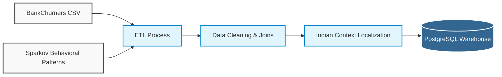

# ETL Pipeline & Localization

This diagram shows how raw external datasets are combined, cleaned, and heavily localized to fit the context of an Indian retail bank before being loaded into the warehouse.

