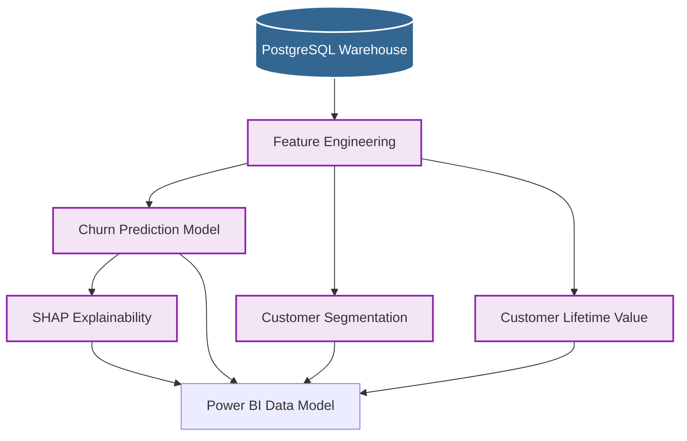

# Machine Learning Pipeline

This diagram maps how historical data from the warehouse is transformed into actionable predictive insights for Power BI.

```mermaid
graph TD
    A[(PostgreSQL Warehouse)] --> B[Feature Engineering]
    
    B --> C[Churn Prediction Model]
    B --> D[Customer Segmentation]
    B --> E[Customer Lifetime Value]
    
    C --> F[SHAP Explainability]
    
    C --> G[Power BI Data Model]
    D --> G
    E --> G
    F --> G

    classDef database fill:#336791,stroke:#fff,stroke-width:2px,color:#fff;
    classDef ml fill:#f3e5f5,stroke:#8e24aa,stroke-width:2px;
    
    class A database;
    class B,C,D,E,F ml;
```
