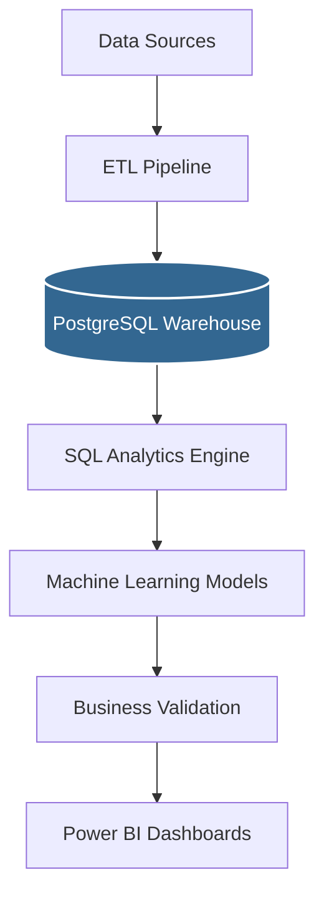

# Solution Architecture

This diagram illustrates the end-to-end data flow from raw sources to executive dashboards.

```mermaid
graph TD
    A[Data Sources] --> B[ETL Pipeline]
    B --> C[(PostgreSQL Warehouse)]
    C --> D[SQL Analytics Engine]
    D --> E[Machine Learning Models]
    E --> F[Business Validation]
    F --> G[Power BI Dashboards]
    
    classDef database fill:#336791,stroke:#fff,stroke-width:2px,color:#fff;
    class C database;
```
