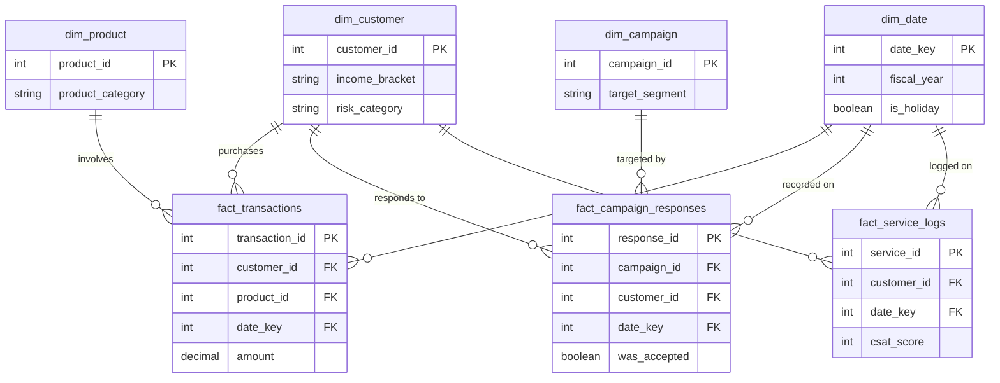

# Star Schema Data Warehouse

The PostgreSQL database is organized into a highly optimized Star Schema, consisting of dimension tables (business entities) and fact tables (business events).

```mermaid
erDiagram
    %% Dimensions
    dim_customer {
        int customer_id PK
        string income_bracket
        string risk_category
    }
    dim_product {
        int product_id PK
        string product_category
    }
    dim_campaign {
        int campaign_id PK
        string target_segment
    }
    dim_date {
        int date_key PK
        int fiscal_year
        boolean is_holiday
    }

    %% Facts
    fact_transactions {
        int transaction_id PK
        int customer_id FK
        int product_id FK
        int date_key FK
        decimal amount
    }
    fact_campaign_responses {
        int response_id PK
        int campaign_id FK
        int customer_id FK
        int date_key FK
        boolean was_accepted
    }
    fact_service_logs {
        int service_id PK
        int customer_id FK
        int date_key FK
        int csat_score
    }

    %% Relationships
    dim_customer ||--o{ fact_transactions : "purchases"
    dim_product ||--o{ fact_transactions : "involves"
    dim_date ||--o{ fact_transactions : "occurs on"

    dim_customer ||--o{ fact_campaign_responses : "responds to"
    dim_campaign ||--o{ fact_campaign_responses : "targeted by"
    dim_date ||--o{ fact_campaign_responses : "recorded on"

    dim_customer ||--o{ fact_service_logs : "initiates"
    dim_date ||--o{ fact_service_logs : "logged on"
```
