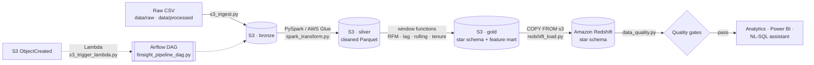

# FinSight 360 — AWS Data Engineering Architecture

This document describes the cloud data-lake pipeline that sits under
FinSight 360. It processes the same data as the original PostgreSQL
pipeline — same customers, transactions, and engineered features — but
on an AWS-native, data-lake architecture that runs for **$0 locally**
(LocalStack + local Spark) and unchanged on real AWS.

## Pipeline overview



## Zones (medallion architecture)

| Zone | Contents | Format | Written by |
|------|----------|--------|-----------|
| **bronze** | Immutable source data, as received | CSV | `s3_ingest.py` |
| **silver** | Cleaned, typed, de-duplicated | Parquet | `spark_transform.py` |
| **gold** | Star schema + `customer_features` mart | Parquet (facts partitioned by year) | `spark_transform.py` |

## Components

| Layer | File | AWS service | Local ($0) equivalent |
|-------|------|-------------|-----------------------|
| Ingestion | `src/aws/s3_ingest.py` | S3 | LocalStack S3 |
| Transform | `src/aws/spark_transform.py`, `glue_job.py` | AWS Glue (Spark) | local PySpark / Glue Docker image |
| Warehouse | `src/aws/redshift_ddl.sql`, `redshift_load.py` | Redshift Serverless | Postgres on `:5439` |
| Orchestration | `dags/finsight_pipeline_dag.py` | Airflow (self-managed) | local Docker Airflow |
| Event trigger | `lambda/s3_trigger_lambda.py` | Lambda | LocalStack Lambda |
| Quality gates | `src/aws/data_quality.py` | (runs in-pipeline) | same |
| CI | `.github/workflows/ci.yml` | GitHub Actions | — |

## Feature engineering (gold `customer_features`)

Computed in Spark with **window functions**:

- **RFM** — Recency (days since last txn vs. dataset max), Frequency
  (transaction count), Monetary (total spend); each scored 1–5 with
  `ntile` over a *total* order (tie-broken by `customer_id` → deterministic).
- **Rolling** — trailing 3-month average spend (`rowsBetween(-2, 0)`).
- **Lag** — 1-month and 3-month lagged spend, month-over-month change.
- **Tenure** — joined from `dim_customer.customer_tenure_months`.

Every ordered window uses an explicit `partitionBy(...).orderBy(...)`, so
output is **deterministic** — migrating from pandas to Spark does not
change the numbers. This is enforced by `tests/test_spark_transform.py`.

## Redshift modelling choices

- **Facts** (`fact_transactions`, `fact_service_logs`,
  `fact_campaign_responses`, `customer_features`): `DISTKEY(customer_id)`
  so customer-grain joins stay node-local; `SORTKEY(date_key)` for
  time-range scans and zone-map pruning.
- **Dimensions** (small): `DISTSTYLE ALL` (replicated to every node).
- Load order is dimensions → facts to respect referential structure.

## Data-quality gates

Run after load; a failure fails the Airflow task (bad data never reaches
analytics):

- row-count floors, key `NOT NULL`, primary-key uniqueness,
  value-range bounds (e.g. utilization ∈ [0,1], RFM scores ∈ [1,5]),
  and referential integrity (fact FKs resolve to dimension keys).

## Cost

| Service | Free? | Notes |
|---------|-------|-------|
| S3, Lambda | ✅ free tier | trivial usage |
| Airflow | ✅ | run locally in Docker (not MWAA) |
| Glue | ⚠️ | develop on the Glue Docker image / local Spark for $0; one real run ≈ a few cents–dollars |
| Redshift | ⚠️ | use the Serverless free-trial credit; pause/delete after use |

Everything here runs end-to-end on **LocalStack + local Spark + local
Postgres at $0**. Switch to real AWS by clearing `AWS_ENDPOINT_URL` and
pointing `REDSHIFT_HOST` at a Redshift endpoint — no code changes.

## Running it

```bash
pip install -r requirements.txt -r requirements-aws.txt
cp .env.aws.example .env         # local mode is the default

make up            # LocalStack + local Redshift
make bootstrap     # create S3 lake bucket + zones
make pipeline      # ingest → transform → load → validate
make test          # lint + unit tests
make down
```
